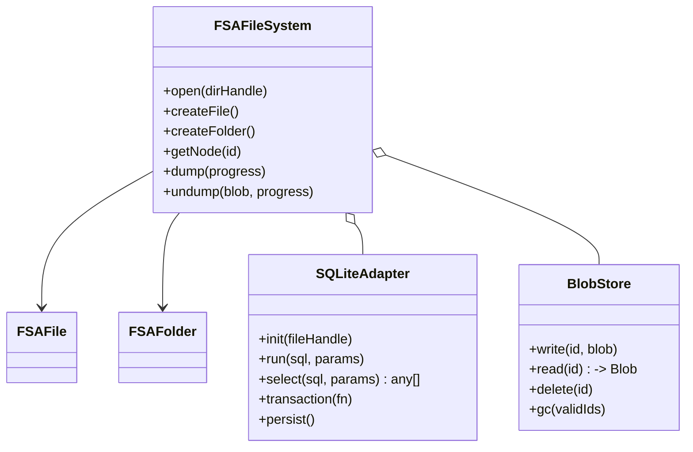

# FileSystem Access API + SQLite ファイルシステム実装計画

## 概要
IndexedDBFileSystem と同等の API を FileSystem Access API (FSAAPI) 上で実装し、メタデータを **sqlite-wasm** で管理する。巨大バイナリは FileSystem Access API のディレクトリ配下に別個保存する BlobStore とし、dump/undump 形式は IndexedDB 版と互換とする。

## 目標
- IndexedDBFileSystem と同一の公開インタフェース（FileSystem/File/Folder）。
- 既存 dump/undump (NDJSON) をそのまま読み書き可能。
- 非同期処理のみで完結。
- 1 万ノード + 100MB バイナリで実用速度。
- 今後 NDJSON バックエンドへ差し替え可能な抽象層を保持。

## ディレクトリ構成
```
.
documents/FileSystemAccessAPI.md   (本書)
src/lib/filesystem/
    indexeddbFileSystem.ts
    sqliteFileSystem.ts           ← 新規
    sqlite/
        initSqlite.ts             ← WASM ローダ
```
- ユーザが選択したディレクトリ:  
  ```
  /<user chosen>/
      filesystem.db
      blobs/
          <nodeId>.bin
  ```

## アーキテクチャ


## SQLite スキーマ
```sql
CREATE TABLE nodes(
  id TEXT PRIMARY KEY,
  type TEXT CHECK(type IN ('file','folder')),
  attributes JSON DEFAULT '{}'
);

CREATE TABLE children(
  parentId TEXT,
  bindId TEXT,
  name TEXT,
  childId TEXT,
  idx INTEGER,
  PRIMARY KEY(parentId, bindId)
);

CREATE TABLE files(
  id TEXT PRIMARY KEY,
  inlineContent TEXT,      -- text or dataURL small payload
  blobPath TEXT,           -- 'blobs/<id>.bin'
  mediaType TEXT           -- 'image' | 'video' | null
);
```
インデックス:
```
CREATE INDEX children_parent_idx ON children(parentId, idx);
```

## 主要クラス責務
| クラス | 役割 |
|-------|------|
| `FSAFileSystem` | FileSystem API 準拠。SQLiteAdapter/BlobStore を保持。 |
| `FSAFile` | read/write (text), readMediaResource/writeMediaResource など。 |
| `FSAFolder` | children 管理 (link/unlink/rename/insert)、属性管理。 |
| `SQLiteAdapter` | **sqlite-wasm** DB ハンドルと FSA 書込ストリームを同期。 |
| `BlobStore` | blobs ディレクトリの読み書き、GC。 |

## dump/undump 互換戦略
- **dump**  
  1. SQLite `SELECT * FROM nodes|children|files` をループし、既存 IndexedDB 版と同じ NDJSON 形式でエンコード。  
  2. BlobStore 内ファイルを DataURL 化し `blob` フィールドへ埋め込む（既存と同様）。  

- **undump**  
  1. NDJSON をストリームで読み込み、メモリにバッファ。  
  2. トランザクションで tables truncate → バッチ INSERT。  
  3. `blob` が DataURL の場合 Fetch → Blob 化 → BlobStore へ保存。  

互換性により、IndexedDBFileSystem で作成済みのアーカイブをそのまま読み込める。

## 実装ステップ
1. **sqlite-wasm 導入**  
   - `npm i sqlite-wasm`  
   - `initSqlite.ts` で `sqlite3InitModule` を非同期ロードしキャッシュ。  
2. **SQLiteAdapter**  
   - `open(dbFileHandle)` で ArrayBuffer load → `sqlite3` DB オブジェクト生成。  
   - `persist()` で DB バイナリをエクスポートし FileSystemWritableFileStream へ書込。  
3. **BlobStore**  
   - `dirHandle.getDirectoryHandle('blobs', { create:true })`.  
   - ID → `${id}.bin` 変換。  
4. **FSAFileSystem**  
   - `open(dirHandle)` でAdapter/BlobStore初期化。  
   - root フォルダの存在を確認、なければ挿入。  
5. **FSAFile/FSAFolder**  
   - メソッド内で SQL 文を構築。IndexedDB 版とシグネチャ揃える。  
6. **dump/undump 実装**  
   - `countLines`, `readNDJSONStream` ユーティリティを共有。  
   - プログレスコールバックは同形式。  
7. **マイグレーションユーティリティ**  
   - IndexedDB → NDJSON dump → FSAFileSystem.undump で自動移行可能。  
8. **テスト**  
   - Jest + jsdom で単体テスト。ブラウザ E2E (Playwright) で大容量シナリオ。  
9. **パフォーマンスチューニング**  
   - `PRAGMA journal_mode = WAL;`  
   - バッチサイズ調整。  
10. **エラーハンドリング**  
    - FSA 権限喪失時は UI にリトライ要求。  
    - SQLiteAdapter の persist 失敗は rollback。  

## 参考データサイズ試算
| ノード数 | メタサイズ | SQLite ファイル | NDJSON export |
|---------|-----------|----------------|--------------|
| 10k     | 3 MB      | ~4 MB          | ~6 MB        |
| バイナリ | 100 MB    | blobs/         | DataURL  ~135 MB |

## 今後の拡張
- バージョン番号を `PRAGMA user_version` で管理し migrate 容易に。  
- マルチタブ排他制御 (SharedWorker + BroadcastChannel)。  
- OPFS 版 BlobStore へ差し替え可能にする Adapter 層。  

---

以上
